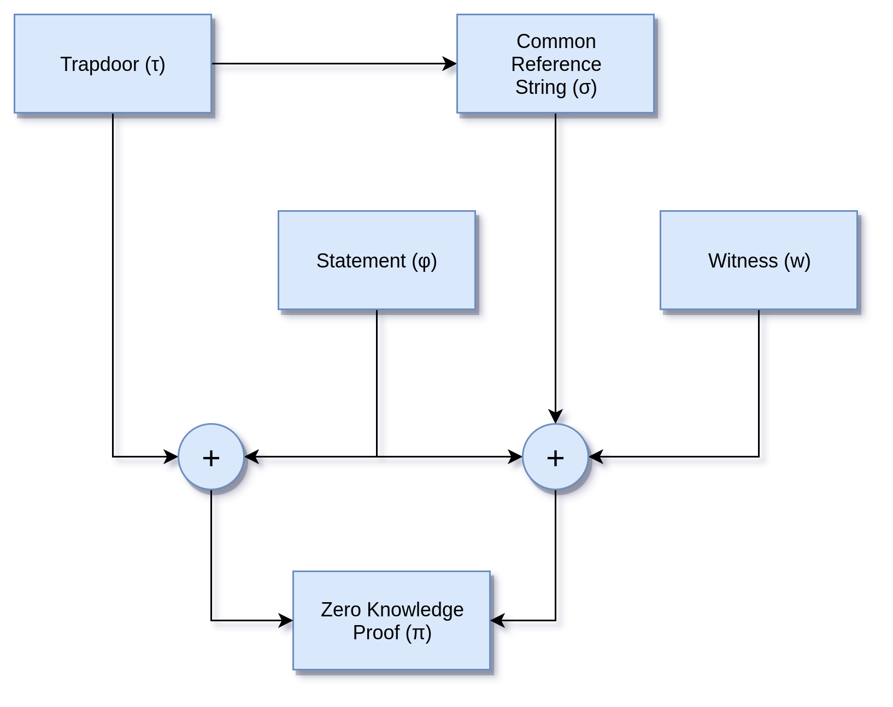

<p align="center">
<a href="https://www.adjoint.io">
  
</a>
</p>

[](https://github.com/adjoint-io/zkp/actions)
[](https://github.com/adjoint-io/zkp/actions)

ZKP
===

* [🇺🇸English ](./README.md)
* [🇨🇳中文](./README.zh.md)
* [🇩🇪Deutsch](./README.de.md)

ZKP is a practical zero knowledge proof system that provides small and
computationally efficient zero-knowledge proofs of arbitrary computations. This
system allows us to construct succinct non-interactive proofs with cheap and
fast verification times. The topology of the proof generation system is
described by the following diagram.

<p align="center">

</p>

## Compiler Stages

* Program Construction
* Trusted Setup
* Proof Generation
* Proof Verification

## Program Construction

Program construction is developed by other libraries which emit a standard JSON
protocol describing the functional composition of gates computing arithmetic
operations of addition and multiplication and with wires. This library can
simply use any other compiler or library which emits JSON as its interchange
format.

A reference library for circuit construction language is provided by
[arithmetic-circuits](https://www.github.com/adjoint-io/arithmetic-circuits)
package.

## Trusted Setup

The trusted setup can be run from the command line. Which will generate the one
time parameters needed to setup for a specific circuit. The setup parameters can
either be subsequently destroyed or distributed in a Shamir secret sharing
configuration. The Shamir sharing allows a n-of-m setup where a minimum of n
participants must combine their secret parts to reconstruct the trusted setup.

```bash
zkp setup --prover Groth16 --input samples/example1.json -o setupdir 
```

This will generate the trusted setup parameters in the `setupdir` directory.
These five random parameters (``α``,``β``,``𝛾``,``δ``,``x``) from the prime
field Fr of the BN254 elliptic curve.

```haskell
RandomSetup
  { setupAlpha =
      P 12256559805687004284032990640481138455228350420895296477627313054450750333538
  , setupBeta =
      P 4401553107086663101145669242467980542018664489189708849056812824771109996937
  , setupGamma =
      P 11751086019938025633396747311851452921508835627313304853903993116945166687533
  , setupDelta =
      P 168604024821165987426171350616143663866971217710026689954359697680025921731
  , setupX =
      P 17090290750981977232640417368259094286138615605287635462955897488010126230557
  }
```

If you wish to use hardware entropy from the kernel to perform the random
generation pass the ``--hardware`` flag during trusted setup.

## Proof Generation

For a given set of valid inputs (``--inputs``), this will generate the proof
term `pi` to a proof file. This contains the succinct zero knowledge proof given
the evaluation of the circuit with the given trusted setup and program inputs.

```bash
zkp prove --input samples/example1.json -d setupdir --inputs samples/inputs1.json --pi proof
```

This will generate a ``π`` proof term which consists of three terms in the
from the bilinear map A : G<sub>2</sub>, B : G<sub>1</sub> and C : G<sub>1</sub>.

```haskell
Proof
  { proofA =
      A (P 4881623700312852323508547682818174690864977127565225101692969747455865314076)
        (P 21226270279582811012422188678741405568697460494611910557066940647978844558004)
  , proofB =
      A (E (P 20323099801991325872207033941577805160427313780137510282152872074461606067272 *
              X +
              P 1422252355533785307633747654423585463232482725315893764382065912760224949248))
        (E (P 3567658277931205602889970963406800124094834788390622140804820116722346374274 *
              X +
              P 15030027696371368845331628915595104373945089162840261486371773861661834388966))
  , proofC =
      A (P 21113978983642622273905001525315900726975017023639887701995527379031005434733)
        (P 1703880359115562486637532379447225273456712398817044635461020607254025768226)
  }
```

## Proof Verification

The verification algorithm takes as input a restricted common reference string
and a proof term (``--pi``), computes the final pairing operation to verify the
integrity of the proof and returns a rejection or an acceptance as exit code.

```bash
zkp verify -d setupdir --inputs samples/inputs1.json --pi proof
```

## Curves

This proof system uses a polymorphic representation of the elliptic curve
operations allowing us to instantiate the prover over several elliptic curves
including:

* BN254
* BLS12-381

## Building from Source

This library compiles on 8.x of the Haskell compiler. To install GHC use
[ghcup](https://www.haskell.org/ghcup/).

```bash
ghcup install 8.6.5
```

After GHC is setup, download this library and build it using `cabal`.

```bash
git clone git@github.com:adjoint-io/zkp.git
cd zkp
cabal new-install --installdir=.
cp ./zkp ~/.local/bin
```

Alternatively this library can be built with
[stack](https://docs.haskellstack.org/en/stable/README/) using:

```bash
cd zkp
stack install
```

## Docker Images

The `zkp` executable can be built and run inside of a Docker image:

```bash
$ docker build -t zkp .
$ docker run -ti zkp /bin/bash
```

## Verification

*This is a optional step and for developers only.*

ZKP is enriched with a set of specifications through refinement types which are
checkable the
[LiquidHaskell](https://ucsd-progsys.github.io/liquidhaskell-tutorial/)
framework. LiquidHaskell analyses the modules and discharges proof obligations
to an SMT solver to see if the conditions are satisfiable.  This allows us to
prove the absence of a family of errors around memory safety, arithmetic
exceptions and information flow.

You will need *either* the Microsoft Research [Z3 SMT
solver](https://github.com/Z3Prover/z3) or Stanford [CVC4 SMT
solver](https://cvc4.github.io/).

For Linux:

```bash
sudo apt install z3 # z3
sudo apt install cvc4 # cvc4
```

For Mac:

```bash
brew tap z3 # z3
brew tap cvc4/cvc4 # cvc4
brew install cvc4/cvc4/cvc4
```

Then install LiquidHaskell either with Cabal or Stack:

```bash
cabal install liquidhaskell
stack install liquidhaskell
```

The verification can then be run over the cryptographic modules in this project.

```bash
liquid -f --cabaldir -i src -i spec src/Poly.hs
liquid -f --cabaldir -i src -i spec src/Protocol/Groth.hs 
```

## Dependencies

This proof system depends on the following dependencies.

* [arithmetic-circuits](https://www.github.com/adjoint-io/arithmetic-circuits) -
  Arithmetic circuits for zero knowledge proof systems
* [pairing](https://www.github.com/adjoint-io/pairing) - Optimised bilinear
  pairings over elliptic curves
* [galois-field](https://www.github.com/adjoint-io/galois-field) - Finite field
  arithmetic
* [galois-fft](https://www.github.com/adjoint-io/galois-fft) - Finite field
  polynomial arithmetic based on fast Fourier transforms
* [elliptic-curve](https://www.github.com/adjoint-io/elliptic-curve) - Elliptic
  curve operations
* [arithmoi](https://www.github.com/adjoint-io/arithmoi) - Number theory
  operations
* [semirings](https://www.github.com/adjoint-io/semirings) - Algebraic semirings
* [poly](https://www.github.com/adjoint-io/poly) - Efficient polynomial
  arithmetic
* [entropy](https://hackage.haskell.org/package/entropy) - Generation of
  hardware entropy for secure trusted setup
* [shamir](https://www.github.com/adjoint-io/shamir) - Shamir secret sharing

## Disclaimer

This program uses the Groth16 and Groth-Maller protocols, both of which are
relatively new protocols only originating in 2016 and 2017.  While these
protocols have been given extensive peer review, their use comes with the
standard cryptography disclaimers. This protocol is also only secure under KEA1.
This library has not undergone audit and is provided strictly without warranty
and only for non-commercial use.
