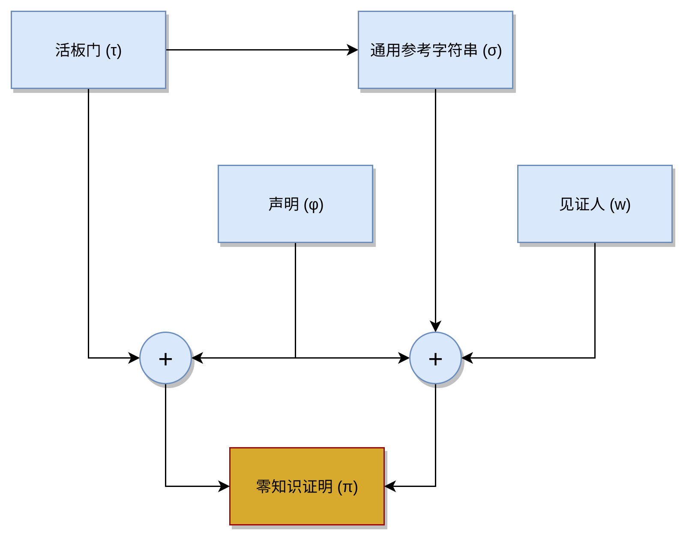

<p align="center">
<a href="https://www.adjoint.io">
  
</a>
</p>

[](https://github.com/adjoint-io/zkp/actions)
[](https://github.com/adjoint-io/zkp/actions)

零知识证明
==========

* [🇺🇸English ](./README.md)
* [🇨🇳中文](./README.zh.md)
* [🇩🇪Deutsch](./README.de.md)

ZKP是一种实用的零知识证明系统，可提供任意计算的小型且计算效率高的零知识证明。
该系统使我们能够以廉价且快速的验证时间构造简洁的非交互式证明。
下图描述了证明生成系统的拓扑。

该协议允许不受信任的各方彼此进行交易，而无需共享信息。

这是用于构建zk-SNARK的密码库。该库可为财务分布式数据库实现交易隐私。

下图描述了证明生成系统的拓扑。

<p align="center">

</p>

## 编译步骤

* 电路构造
* 值得信赖的设置
* 证明制作
* 证明验证

<!-- Program Construction -->
## 程序建设

程序构建是由其他库开发的，这些库发出标准的JSON协议，该协议描述了门的功能组成，这些门计算加法，乘法和带导线的算术运算。
该库可以简单地使用任何其他编译器或库来发出JSON作为其交换格式。

算术电路包提供了电路构造语言的参考库。

[arithmetic-circuits](https://www.github.com/adjoint-io/arithmetic-circuits)

<!-- Trusted Setup -->
## 受信任的设置

可以从命令行运行受信任的设置。 这将生成为特定电路设置所需的一次参数。 设置参数可以随后销毁，也可以在Shamir秘密共享配置中分发。 Shamir共享允许一个n-of-m的设置，其中至少n个参与者必须组合其秘密部分以重建受信任的设置。

```bash
zkp setup --prover Groth16 --input samples/example1.json -o setupdir 
```

这将在setupdir目录中生成受信任的设置参数。 来自BN254椭圆曲线的素数场Fr的这五个随机参数（α，β，𝛾，δ，x）。

```haskell
RandomSetup
  { setupAlpha =
      P 12256559805687004284032990640481138455228350420895296477627313054450750333538
  , setupBeta =
      P 4401553107086663101145669242467980542018664489189708849056812824771109996937
  , setupGamma =
      P 11751086019938025633396747311851452921508835627313304853903993116945166687533
  , setupDelta =
      P 168604024821165987426171350616143663866971217710026689954359697680025921731
  , setupX =
      P 17090290750981977232640417368259094286138615605287635462955897488010126230557
  }
```

如果您希望使用内核中的硬件熵来执行随机生成，请在受信任的设置过程中传递--hardware标志。

<!-- Trusted Proof Generation -->
## 证明生成

对于给定的一组有效输入（-a），这将在输出目录内部生成证明项pi。 如果使用给定的可信设置和专用输入对电路进行评估，则其中包含简洁的零知识证明。

```bash
zkp prove --input samples/example1.json -d setupdir --inputs samples/inputs1.json --pi proof
```

这将生成一个π证明项，该项由双线性映射A : G<sub>2</sub>，B : G<sub>1</sub>和 C:G<sub>1</sub> 中的三个项组成。

```haskell
Proof
  { proofA =
      A (P 4881623700312852323508547682818174690864977127565225101692969747455865314076)
        (P 21226270279582811012422188678741405568697460494611910557066940647978844558004)
  , proofB =
      A (E (P 20323099801991325872207033941577805160427313780137510282152872074461606067272 *
              X +
              P 1422252355533785307633747654423585463232482725315893764382065912760224949248))
        (E (P 3567658277931205602889970963406800124094834788390622140804820116722346374274 *
              X +
              P 15030027696371368845331628915595104373945089162840261486371773861661834388966))
  , proofC =
      A (P 21113978983642622273905001525315900726975017023639887701995527379031005434733)
        (P 1703880359115562486637532379447225273456712398817044635461020607254025768226)
  }
```

<!-- Proof Verification -->
## 证明验证

验证算法将受限的公共参考字符串和证明项（--pi）作为输入，计算最终配对操作以验证随后证明的完整性，并以拒绝或接受作为退出码返回。

```bash
zkp verify -d setupdir --inputs samples/inputs1.json --pi proof
```

<!-- Proof Servers -->
## 数学证明服务器

有多种证明服务，允许公共用户进行时间戳记并以数字方式签署零知识证明的输出。 Adjoint在此处托管公共证明服务器。

[dragon.adjoint.io](https://adjoint-io.github.io/dragon-website/index_zh.html)

<!-- Curves -->
## 椭圆曲线

该证明系统使用椭圆曲线操作的多态表示形式，使我们可以在多个椭圆曲线上实例化证明者，其中包括：

* BLS12-381
* BN254

<!-- Building from Source -->
## 从源头建造

该库在Haskell编译器的8.x上编译。 要安装GHC，请使用[ghcup](https://www.haskell.org/ghcup/)。

```bash
ghcup install 8.6.5
```

设置GHC后，下载此库并使用cabal进行构建。

```bash
git clone git@github.com:adjoint-io/zkp.git
cd zkp
cabal new-install --installdir=.
cp ./zkp ~/.local/bin
```

另外，您可以使用[Stack](https://docs.haskellstack.org/en/stable/README/)使用以下命令构建库：

```bash
cd zkp
stack install
```

<!-- Docker Images -->
## Docker映像

可以在Docker映像内部构建和运行zkp可执行文件：

```bash
$ docker build -t zkp .
$ docker run -ti zkp /bin/bash
```

<!-- Verification -->

## 验证

*这是可选步骤，仅适用于开发人员。*

ZKP通过精化类型丰富了一系列规范，这些规范可以在LiquidHaskell框架中进行检查。 LiquidHaskell分析模块，并向SMT求解器履行证明义务，以查看条件是否可满足。 这使我们能够证明在内存安全性，算术异常和信息流方面不存在一系列错误。

您将需要Microsoft Research [Z3 SMT](https://github.com/Z3Prover/z3)求解器或Stanford [CVC4 SMT](https://cvc4.github.io/)求解器。

对于Linux：

```bash
sudo apt install z3 # z3
sudo apt install cvc4 # cvc4
```

对于Mac：

```bash
brew tap z3 # z3
brew tap cvc4/cvc4 # cvc4
brew install cvc4/cvc4/cvc4
```

然后使用Cabal或Stack安装LiquidHaskell：

```bash
cabal install liquidhaskell
stack install liquidhaskell
```

然后可以在该项目中的加密模块上运行验证。

```bash
liquid -f --cabaldir -i src -i spec src/Poly.hs
liquid -f --cabaldir -i src -i spec src/Protocol/Groth.hs 
```

<!-- Dependencies -->

## 库依赖

该系统取决于以下依赖性。

* [零知识证明系统的算术电路](https://www.github.com/adjoint-io/arithmetic-circuits)
* [也叫双线性映射](https://www.github.com/adjoint-io/pairing)
* [生成硬件熵以实现安全可信的设置](https://hackage.haskell.org/package/entropy)
* [有限域算术](https://www.github.com/adjoint-io/galois-field)
* [基于快速傅立叶变换的有限域多项式算法](https://www.github.com/adjoint-io/galois-fft)
* [椭圆曲线运算](https://www.github.com/adjoint-io/elliptic-curve)
* [数论运算](https://hackage.haskell.org/package/arithmoi)
* [代数半环](https://www.github.com/adjoint-io/semirings)
* [高效的多项式算法](https://www.github.com/adjoint-io/poly)
* [Shamir秘密分享](https://www.github.com/adjoint-io/shamir)
